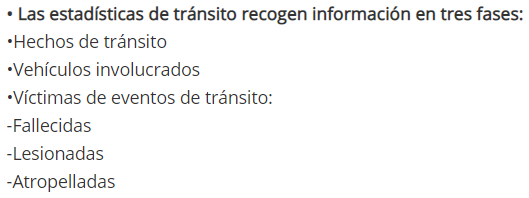
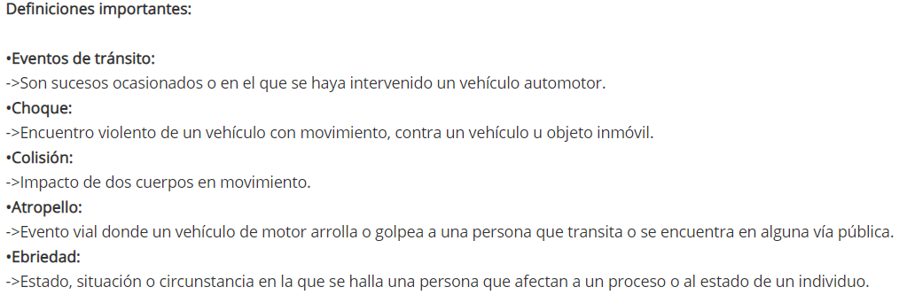

# Análisis realizado con base en únicamente los diccionarios
## Cambios recientes 
### Comparación de diccionarios de 2018-2019 con diccionarios de 2017
#### Mejoras
##### Generales
* Diccionario de 2018-2019 menciona al lector cambios relevantes con respecto a 2017
* Diccionarios de 2017 no incluyen el nombre de la columna en la base de datos, solo la representación de la variable, lo cual se agregó para el de 2018.
* Se cambió el código de rango de modelo de vehículo de ignorado (6 a 99), una mejor práctica para la imputación de datos, ya que, pareciendo que el intervalo son 10 años, el 6 sería necesario utilizarlo a partir de este año.
* Se redujo la cantidad de tipos de evento, ya que en 2017 las categorías incluían un repertorio de categorías confusas, o que bien podrían contar como causas de otra de las categorías, por ejemplo:
  + Pérdida de control
  + Colisisón contra animal
  + Exceso de pasaje
  + Asfalto mojado
  + Exceso de velocidad
  + Desperfectos mecánicos
  + Incendio

### Oportunidades de mejora de diccionarios actuales
#### Generales
* No se mencionan todos los cambios con respecto al diccionario de 2017, por ejemplo:
  + 2018 agrega Furgoneta a tipos de vehículo
  + 2018 agrega "Varios colores" y quita "Aqua" de colores de vehículo
  + 2018 cambia categorías de estado del conductor, que solían ser "Normal", "Bajo influencia de alcohol", "Drogado" e "Ignorado" por "No ebrio", "Ebrio" e "Ignorado." No hay explicación de por qué se dio este cambio, ya que en el Artículo 175 de la Ley y Reglamento de tránsito sí se menciona que se realizan pruebas de "alcoholemia y/o influencias de drogas, estupefacientes o sustancias psicotrópicas" (aunque no entra en detalle de cuáles son las mismas). La descripción dada por el INE de ebriedad parece cubrir todos los casos mencionados ("estado, situación o circunstancia en la que se halla una persona que afectan a un proceso o al estado de un individuo"), pero es poco común usar el término "ebriedad" para los mismos.
  + diccionario de fallecidos y lesionados agrega en 2018 la categoría de "Ignorado" para la etiqueta de "Internado o no internado"
* Si lo que se desea es evitar futuros accidentes, no basta con únicamente presentar la zona del hecho. El tener la latitud y longitud podría indicar la dirección del hecho, y podrían evaluarse (dependiendo del tipo de accidente), si se realizan proyectos como colocación de semáforos, ampliamiento de carriles, señalizaciones, pasarelas, etc.
* Códigos correspondientes al color de vehículo no tienen ningún tipo de orden. Hay colores que podrían quedar a discresión de quien registra (¿qué distingue a un carro marfil de un carro blanco, por ejemplo, es necesario tener tres distintos tonos de azul (azul, celeste y turquesa)?).
* Demasiadas categorías de tipo de vehículo, sin ningún orden aparente.
* Demasiadas variables para guardar las edades de los involucrados, cuando es suficiente el campo de edad. En últimas, hacer divisiones que tengan un poco más de sentido: 
* ¿En qué punto un derrape puede considerarse un tipo de accidente, o es más una causa de accidente? Dado esto, ¿debería existir un apartado de "causa del evento" (donde podrían ir aquellas categorías mencionadas de 2017)?

#### Vehículos involucrados/Hechos de tránsito
* No hay manera de saber qué vehículos estuvieron involucrados en el mismo hecho de tránsito. De la misma manera, un hecho de tránsito no indica la cantidad de vehículos involucrados. 

#### Fallecidos y lesionados
* Actualmente, no se distingue entre si la persona en cuestión fue el conductor (a menos que toda su información coincida con la de la base de datos de vehículo), pasajero o un peatón, es decir, si hubo atropellados, a pesar de que esto se encuentra en la ficha técnica provista por el INE. No solo la siguiente información no es correcta, sino que añade la incógnita, ¿cómo se sabe si uno de los atropellados falleció o no?

{width=450px}

#### Otras dudas y observaciones
* ¿Por qué y en base a qué criterio se hacen los rangos y agrupaciones de horas y edades de la INE?
* ¿Cuál es la razón por que se incluyan rangos de edades? ¿Tienen algún fundamento estadístico? De lo contrario, estas únicamente hacen más "pesada" la base de datos.
* ¿Por qué los hechos registran información del vehículo?

# Análisis exploratorio
```{r warning=FALSE, error=FALSE, message=FALSE}
library(readxl)
library(tidyverse)
```

## Cargar bases de datos
```{r warning=FALSE, error=FALSE, message=FALSE}
hechos_2019 <- read_excel("./Datasets/Hechos_de_transito_2019.xlsx") %>% mutate(nuevo_num = paste(`núm_corre`,`año_ocu`,sep="")) # Para poder hacer joins, les agregaremos esta columna
hechos_2018 <- read_excel("./Datasets/Hechos_de_transito_2018.xlsx") %>% mutate(nuevo_num = paste(`núm_corre`,`año_ocu`,sep=""))
na.omit(hechos_2019) #Mantiene el mismo numero de filas, no hay datos faltantes
na.omit(hechos_2018) #Mantiene el mismo numero de filas, no hay datos faltantes

hechos <- rbind(hechos_2019,hechos_2018)

vehiculos_2019 <- read_excel("./Datasets/Vehiculos_involucrados_2019.xlsx") %>% mutate(nuevo_num = paste(`núm_corre`,`año_ocu`,sep="")) # Para poder hacer joins, les agregaremos esta columna
vehiculos_2018 <- read_excel("./Datasets/Vehiculos_involucrados_2018.xlsx") %>% mutate(nuevo_num = paste(`núm_corre`,`año_ocu`,sep=""))

na.omit(vehiculos_2019) #Mantiene el mismo numero de filas, no hay datos faltantes
na.omit(vehiculos_2018) #Mantiene el mismo numero de filas, no hay datos faltantes

vehiculos <- rbind(vehiculos_2019,vehiculos_2018)

fal_les_2019 <- read_excel("./Datasets/Fallecidos_y_lesionados_2019.xlsx") %>% mutate(nuevo_num = paste(`núm_corre`,`año_ocu`,sep="")) # Para poder hacer joins, les agregaremos esta columna
fal_les_2018 <- read_excel("./Datasets/Fallecidos_y_lesionados_2018.xlsx") %>% mutate(nuevo_num = paste(`núm_corre`,`año_ocu`,sep=""))


na.omit(fal_les_2019) #Mantiene el mismo numero de filas, no hay datos faltantes
na.omit(fal_les_2018) #Mantiene el mismo numero de filas, no hay datos faltantes

fal_les <- rbind(fal_les_2019,fal_les_2018)
```

Se puede observar que no hay NA's en la información. Sin embargo, se sabe que varias columnas cuentan con un código para "Ignorado." Si bien esta información no puede ser útil, de hecho nos puede indicar qué departamentos necesitan mejorar su proceso de recopilación de información.

### Limpieza de datos
En vista de que no hay filas faltantes, las eliminaciones iniciales en realidad se basaron más en los diccionarios del INE. Las columnas que se decidieron eliminar fueron ya que, o no se proporciona información útil sobre las mismas (como los códigos de los modelos de vehículos, los cuales no tienen ninguna referencia), o los grupos de hora.

Además, se tomaron estos valores y códigos de los diccionarios, y se le adjuntaron como columnas a las bases de datos correspondientes.

Se consideró dejar la marca del vehículo para poder relacionar vehículos involucrados con hechos, pero nuevamente, ya que hechos solo registra información de uno de los vehículos involucrados, en realidad solo se podrá relacionar un vehículo al mismo.
```{r warning=FALSE, error=FALSE, message=FALSE}
# Variables que no nos sirven porque pueden deducirse con otras o no dicen nada significativo
hechos$g_hora = NULL
hechos$marca_veh = NULL
hechos$g_modelo_veh = NULL
hechos$g_hora_5 = NULL


hechos <- merge(merge(merge(merge(merge(merge(merge(hechos, read.csv("./Datasets/Normalizadas/color_veh.csv", encoding="UTF-8")), read.csv("./Datasets/Normalizadas/deptos_code_g.csv", encoding="UTF-8")),read.csv("./Datasets/Normalizadas/tipo_eve.csv", encoding="UTF-8")), read.csv("./Datasets/Normalizadas/dia.csv", encoding="UTF-8")),read.csv("./Datasets/Normalizadas/mes_ocu.csv", encoding="UTF-8")),read.csv("./Datasets/Normalizadas/municipios_g.csv", encoding="UTF-8")),read.csv("./Datasets/Normalizadas/veh.csv", encoding="UTF-8"))%>% filter(tipo_eve<99) # No queremos eventos ignorados, ya que no nos sirve de nada

hechos$año_ocu <-  as.factor(hechos$año_ocu)
hechos$mupio_name <-  as.factor(hechos$mupio_name)

# Variables que no nos sirven porque pueden deducirse con otras o no dicen nada
vehiculos$g_hora = NULL
vehiculos$marca_veh = NULL
vehiculos$g_modelo_veh = NULL
vehiculos$g_edad_80ymás = NULL
vehiculos$g_edad_60ymás = NULL
vehiculos$edad_quinquenales = NULL
vehiculos$g_hora_5 = NULL

vehiculos <- merge(merge(merge(merge(merge(merge(merge(vehiculos, read.csv("./Datasets/Normalizadas/color_veh.csv", encoding="UTF-8")), read.csv("./Datasets/Normalizadas/deptos_code_g.csv", encoding="UTF-8")),read.csv("./Datasets/Normalizadas/tipo_eve.csv", encoding="UTF-8")), read.csv("./Datasets/Normalizadas/dia.csv", encoding="UTF-8")),read.csv("./Datasets/Normalizadas/mes_ocu.csv", encoding="UTF-8")),read.csv("./Datasets/Normalizadas/municipios_g.csv", encoding="UTF-8")),read.csv("./Datasets/Normalizadas/veh.csv", encoding="UTF-8")) %>% filter(tipo_eve<99) # No queremos eventos ignorados, ya que no nos sirve de nada

vehiculos$año_ocu <-  as.factor(vehiculos$año_ocu)
vehiculos$mupio_name <-  as.factor(vehiculos$mupio_name)
vehiculos$veh <-  as.factor(vehiculos$veh)


fal_les$g_hora = NULL
fal_les$marca_veh = NULL
fal_les$g_modelo_veh = NULL
fal_les$g_edad_80ymás = NULL
fal_les$g_edad_60ymás = NULL
fal_les$edad_quinquenales = NULL
fal_les$g_hora_5 = NULL

fal_les <- merge(merge(merge(merge(merge(merge(merge(merge(fal_les, read.csv("./Datasets/Normalizadas/color_veh.csv", encoding="UTF-8")), read.csv("./Datasets/Normalizadas/deptos_code_g.csv", encoding="UTF-8")),read.csv("./Datasets/Normalizadas/tipo_eve.csv", encoding="UTF-8")), read.csv("./Datasets/Normalizadas/dia.csv", encoding="UTF-8")),read.csv("./Datasets/Normalizadas/mes_ocu.csv", encoding="UTF-8")),read.csv("./Datasets/Normalizadas/municipios_g.csv", encoding="UTF-8")),read.csv("./Datasets/Normalizadas/veh.csv", encoding="UTF-8")), read.csv("./Datasets/Normalizadas/fal_les.csv", encoding="UTF-8")) %>% filter(tipo_eve<99) # No queremos eventos ignorados, ya que no nos sirve de nada

fal_les$año_ocu <-  as.factor(fal_les$año_ocu)
fal_les$mupio_name <-  as.factor(fal_les$mupio_name)
fal_les$veh <-  as.factor(fal_les$veh)
fal_les$fal_les_n <-  as.factor(fal_les$fal_les_n)

```

# Falencias de la base de datos
## Generales
1. La "hora" a la que ocurrió el hecho literalmente es, solo la hora. No se registran los minutos. Incluso, sería útil tener un rango de medias horas. Esto hace incluso más difícil las circunstancias de averiguar qué hechos están relacionados, como se presenta a continuación.
2. El que se admita la zona como "Ignorado" es una gran deficiencia, pues no permite el saber dónde exactamente es el problema, o cómo arreglarlo. 

## Fallecidos y lesionados
1. No hay manera de saber si, en caso de atropello, este fue el peatón u otra víctima.
La siguiente es la cantidad de hechos sin información alguna del vehículo.
```{r warning=FALSE, error=FALSE, message=FALSE}
sin_info_veh <- hechos %>% filter(modelo_veh==9999, tipo_veh==99, color_veh==99)
sin_info_veh %>% count()
```
Si bien esto parece ser menos de 10% para ambos años, incluso veamoslo por año.

```{r}
cat(sprintf("2018: %s de %s, 2019: %s de %s" ,sin_info_veh %>% filter(año_ocu==2018) %>% count(), hechos %>% filter(año_ocu==2018) %>% count(), sin_info_veh %>% filter(año_ocu==2019) %>% count(), hechos %>% filter(año_ocu==2019) %>% count()))
```
Se puede observar que, 

```{r warning=FALSE, error=FALSE, message=FALSE}
sin_info_veh %>% select(evento) %>% add_count(evento) %>% group_by(evento) %>% distinct()
```

Se puede observar que la mayoría de hechos en los que se ignora toda la información que concierne al vehículo son atropellos. ¿Por qué es esto? Los que no tienen que ver con atropellos pueden tomarse como error, o se podría especular que son vehículos que espacaron del lugar del accidente. Además, es curioso como no se tiene información de un vehículo en un encuneto.

```{r warning=FALSE, error=FALSE, message=FALSE}
fal_les %>% filter(evento=="Atropello", modelo_veh==9999, tipo_veh==99, color_veh==99) %>% count()
```

Parece haber un número incluso más alto de fallecidos y lesionados por atropellos en los que no se registra información alguna del vehículo. ¿Podrían ser estos peatones? ¿Por qué no existe entonces esta categoría?


## Hechos
1. Se guarda la información de solo uno de los vehículos involucrados, lo cual no hace sentido.

## Vehículos involucrados
1. No hay manera de saber, a priori, si hubo más de un vehículo involucrado, y si sí, con qué hecho se relacionan. Para lo mismo, se debió realizar la siguiente limpieza:
  + eliminar "zonas desconocidas" para evitar duplicados
  + eliminar filas duplicadas en cualquier base de datos, ya que no podría realizarse un "inner join" apropiado con las mismas (la relación en vez de ser, en el caso de vehículos y hechos, de muchos a uno, se volvería de muchos a muchos).

Debido a que actualmente, si se cuentan con columnas que repiten año, mes, día, hora, municipio, zona y tipo de evento, no es posible relacionar los vehículos con un solo evento. Si intentamos hacer este merge, se verá que terminamos teniendo más filas que las correspondientes a los vehículos involucrados, lo cual no es posible. Nótese:
```{r error=FALSE, message=FALSE, warning=FALSE}
vehiculos_y_hechos <- merge(hechos %>% select(año_ocu, mes_ocu, día_ocu, hora_ocu, mupio_ocu, zona_ocu, tipo_eve) %>% filter(zona_ocu != 99), vehiculos %>% filter(zona_ocu != 99))
cat(sprintf("Total de vehículos, excluyendo zonas ignoradas: %s\nFilas en merge de vehiculos y hechos, excluyendo zonas ignoradas: %s", vehiculos %>% filter(zona_ocu != 99) %>% count(), vehiculos_y_hechos %>% count()))
```

4800 > 4709, hay 91 nuevas filas, por lo cual se tendríamos que excluir todas las instancias de hechos que repiten año, mes, día, hora, municipio, zona y tipo de evento.

```{r}
all_just_hechos <- hechos %>% select(año_ocu, mes_ocu, día_ocu, hora_ocu, mupio_ocu, zona_ocu, tipo_eve) %>% filter(zona_ocu != 99)

hechos_to_delete <- rev(which(duplicated(all_just_hechos) | duplicated(all_just_hechos, fromLast = TRUE)))

just_hechos_clean <- all_just_hechos
  
for(i in hechos_to_delete){
  just_hechos_clean <- just_hechos_clean[-i,]
}

vehiculos_y_hechos_clean <- merge(just_hechos_clean, vehiculos %>% select(-c("núm_corre","nuevo_num")) %>% filter(zona_ocu != 99))
v_y_h_names <- colnames(vehiculos_y_hechos_clean)
v_y_h_names[12] <- "sexo_con" # sexo del conductor
v_y_h_names[13] <- "edad_con" # sexo del conductor
v_y_h_names[15] <- "mayor_menor_con" # sexo del conductor
colnames(vehiculos_y_hechos_clean) <- v_y_h_names

veh_hec_fal_les_all <- merge(vehiculos_y_hechos_clean, fal_les, all.x=T)
veh_hec_fal_les <- merge(vehiculos_y_hechos_clean, fal_les)
cat(sprintf("Filas de hechos y vehiculos involucrados = %s \nFilas de hechos, vehículos involucrados y fallecidos/lesionados (incluye hechos en los que no hubo fallecidos ni lesionados) = %s \nFilas de inner join (solo hechos con fallecidos y/o lesionados) = %s",vehiculos_y_hechos_clean %>% count(), veh_hec_fal_les_all %>% count() , veh_hec_fal_les %>% count()))
```

Inicialmente, se teníán más de 13 mil filas en la base de datos de hechos. De estos, terminado con únicamente 5283 filas que son posibles analizar, y esto ha sido el solo excluyendo zonas clasificadas como ignoradas, y hechos distinguibles con respecto a año, mes, día, hora, municipio, zona y tipo de evento.


2. ¿Verdaderamente son necesarias todas las categorías de colores que hay?
```{r warning=FALSE, error=FALSE, message=FALSE}
vehiculos %>% add_count(color_veh, color) %>% select(color_veh, color, n) %>% distinct() %>% arrange(color_veh)
```
Puede verse que no hay ninguna instancia del color_veh con código 13.
```{r}
read.csv("./Datasets/Normalizadas/color_veh.csv", encoding="UTF-8")
```

Este color faltante es "marfil", y este código se podría considerar innecesario, o sustituible por "blanco." Ahora, rosado es el menos frecuente, pero por experiencia personal tampoco son muy abundantes. La interesante es la que concierne a vehículos de color turquesea, ya que hay tan pocos en los datos. Esto podría deberse a escacez de los mismos, o a que este color es fácil de confundir con el celeste.


### Análisis de la información que sí tenemos
```{r}
veh_hec_fal_les <- merge(merge(merge(veh_hec_fal_les, read.csv("./Datasets/Normalizadas/sexo.csv", encoding="UTF-8")),read.csv("./Datasets/Normalizadas/sexo_con.csv", encoding="UTF-8")),read.csv("./Datasets/Normalizadas/estado.csv", encoding="UTF-8"))

veh_hec_fal_les$mes <- with(veh_hec_fal_les, reorder(mes,mes_ocu))


ggplot(veh_hec_fal_les %>% filter(veh!=99), aes(x=veh)) + geom_bar() + theme_classic() + facet_grid(año_ocu~fal_les_n) + theme(axis.text.x = element_text(angle = 90, vjust = 0.5, hjust=1)) + ylab(element_blank()) + xlab(element_blank()) + labs(title="Cantidad de fallecidos y lesionados, por tipo de vehículo", subtitle="(donde los fallecidos o lesionados iban dentro de dicho vehículo)")
```
```{r}
ggplot(vehiculos_y_hechos_clean %>% filter(veh!=99), aes(x=veh)) + geom_bar() + theme_classic() + facet_grid(año_ocu~.) + theme(axis.text.x = element_text(angle = 90, vjust = 0.5, hjust=1)) + ylab(element_blank()) + xlab(element_blank()) + labs(title="Vehículos más frecuentes en hechos")
```
Se puede ver que los vehículos que más frecuentemente se encuentran en un accidente, son los que más presentan fallecidos y lesionados. También, llama la atención que los motociclistas parecen ser los más afectados.

```{r}
vehiculos_y_hechos_clean %>% select(mupio_ocu, mupio_name) %>% distinct()
```
Se puede ver que, de todos los datos registrados, el único municipio es Guatemala. Esto muestra una clara deficiencia en la recolección de datos de la PNC en el resto de municipios (o bien, indica de la base de datos que solo con filtrar la zona, se pierde mucha de la información útil, indicando que debería buscar mejorarse la recopilación de ubicación).

```{r}
ggplot(vehiculos_y_hechos_clean %>% filter(tipo_eve!=99), aes(x=as.factor(zona_ocu))) + geom_bar() + theme_classic() + facet_grid(evento~.) + theme(axis.text.x = element_text(angle = 90, vjust = 0.5, hjust=1)) + ylab(element_blank()) + xlab(element_blank()) + labs(title="Tipo más frecuente de accidente, por zona del municipio de Guatemala")

```


# ¿Qué se hace en otros países?
* El Road Safety Database del International Traffic Safety Data and Analysis Group (IRTAD) divide las edades en menores de 16, de 16 a 20 y mayores de 20, lo cual correspondería a menores de edad que no tienen licencia, menores que ya podrían tener licencia y legalmente mayores de edad (https://www.itf-oecd.org/irtad-road-safety-database); esto hace más sentido a tener la cantidad de categorías con la que se cuenta actualmente en la base de datos.
* El IRTAD y el National Highway Traffic Safety Administration (NHTSA) (https://cdan.nhtsa.gov/STSI.htm#) distinguen, ya sea fallecido o lesionado, entre conductor, pasajero del vehículo, o peatón, información faltante en los datos del INE.
* El IRTAD y el NHTSA indican si el conductor y/o pasajeros llevaba medidas de protección (cinturón o casco). 
* La NHTSA también evalúa los fallecimientos relacionados con la velocidad del vehículo, lo que nos regresa a la pregunta de si debería tenerse un apartado de causa de accidente (como velocidad, piso mojado, niebla). Esto también es un campo que puede verse formularios de aseguradoras.
* El University of Florida GeoPlan Center almacena la hora exacta, la ubicación exacta, al igual que si el conductor estaba "distraído," lo cual podría asumirse se refiere al uso de teléfono (https://www.arcgis.com/apps/Cascade/index.html?appid=9a27635635c940539b96fb5ef954e4d5).
* El Johns Creek Police Department de Atlanta utiliza ArcGIS, una herramienta de Esri diseñada para la recopilación y el análisis de información geográfica, para registrar los accidentes ocurridos (https://hub.arcgis.com/datasets/87b758aaf694473eb98ac12f3caba5fc_0?selectedAttribute=RoadType). Además, guardan información sobre la carretera (imperfecciones, si estaba mojada), condiciones climáticas, y en qué parte ocurrió (en la carretera, en la banqueta, en una intersección, paso de cebra, entre otros).

# Soluciones propuestas
En orden de prioridad:

1. Uno de los problemas actuales es la frecuente utilización de ignorados en zonas, ya que al final solo se contaba con información del municipio de Guatemala. Se recomienda cambiar este sistema y registrar la latitud y longitud, o evaluar las mejoras que la PNC debe hacer con la recopilación de estos datos.

2. Distinguir si el lesionado o fallecido fue conductor, pasajero o peatón, ya sea para una campaña, ya sea impulsada por alguna entidad gubernamental, o debido a que sería especialmente importante para evaluar la colocación de pasarelas.

3. Mejorar los diccionarios provistos en el sitio; Se encontraron las siguientes definiciones en el sitio del INE, algunas de las cuales se discutieron en clase:

{width=750px} 

Estas deberían agregarse a los diccionarios de términos, junto con la de "Ebriedad" anteriormente mencionada, y no dar por sentado que quien descargue las bases de datos las leerá o encontrará.

4. Distinguir "tipo de evento" de "causa de evento", especialmente en el caso de "Derrape", así como de 2017 a 2018 se eliminaron varias categorías.
5. Ajustando la data al las leyes de Guatemala, los grupos de edades podrían ser las clasificaciones de menores de 16, de 16 a 18 y mayores de 18, pero nuevamente cabe recalcar que no sería necesario el recopilar estas en sí, ya que puede obtenerse de el campo de edad. Esta información se considera más relevante que los grupos de 5 años
6. Si se desearan evitar accidentes relacionados con falta de medidas de seguridad, sería valioso el recopilar cuántos fallecidos y lesionados si las cumplen o no. En base a esto, podrían realizarse campañas promoviendo el uso del cinturón y de cascos. Estos mismos deberían incluir un campo de "No aplica" (por ejemplo, las motos no llevan cinturón, conductores de autos no usan cascos), diferente del "Ignorado".
7. Añadir el minuto, o algún campo que ayude a acortar la posibilidad de accidentes repetidos debido a horas inexactas.