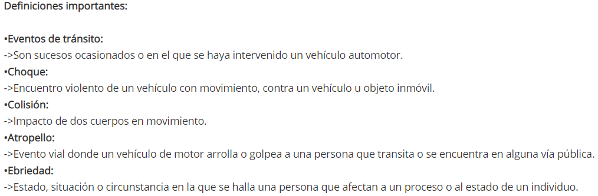
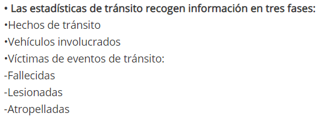

# Análisis realizado con base en únicamente los diccionarios
## Cambios recientes 
### Comparación de diccionarios de 2018-2019 con diccionarios de 2017
#### Mejoras
##### Generales
* Diccionario de 2018-2019 menciona al lector cambios relevantes con respecto a 2017
* Diccionarios de 2017 no incluyen el nombre de la columna en la base de datos, solo la representación de la variable, lo cual se agregó para el de 2018.
* Se cambió el código de rango de modelo de vehículo de ignorado (6 a 99), una mejor práctica para la imputación de datos, ya que, pareciendo que el intervalo son 10 años, el 6 sería necesario utilizarlo a partir de este año.
* Se redujo la cantidad de tipos de evento, ya que en 2017 las categorías incluían un repertorio de categorías confusas, o que bien podrían contar como causas de otra de las categorías, por ejemplo:
  + Pérdida de control
  + Colisisón contra animal
  + Exceso de pasaje
  + Asfalto mojado
  + Exceso de velocidad
  + Desperfectos mecánicos
  + Incendio

### Oportunidades de mejora de diccionarios actuales
#### Generales
* No se mencionan todos los cambios con respecto al diccionario de 2017, por ejemplo:
  + 2018 agrega Furgoneta a tipos de vehículo
  + 2018 agrega "Varios colores" y quita "Aqua" de colores de vehículo
  + 2018 cambia categorías de estado del conductor, que solían ser "Normal", "Bajo influencia de alcohol", "Drogado" e "Ignorado" por "No ebrio", "Ebrio" e "Ignorado"
  + diccionario de fallecidos y lesionados agrega en 2018 la categoría de "Ignorado" para la etiqueta de "Internado o no internado"
* Si lo que se desea es evitar futuros accidentes, no basta con únicamente presentar la zona del hecho. El tener la latitud y longitud podría indicar la dirección del hecho, y podrían evaluarse (dependiendo del tipo de accidente), si se realizan proyectos como colocación de semáforos, ampliamiento de carriles, señalizaciones, pasarelas, etc.
* Códigos correspondientes al color de vehículo no tienen ningún tipo de orden. Hay colores que podrían quedar a discresión de quien registra (¿qué distingue a un carro marfil de un carro blanco, por ejemplo, es necesario tener tres distintos tonos de azul (azul, celeste y turquesa)?). TODO: ¿Puede ser por frecuencia?
* Demasiadas categorías de tipo de vehículo, sin ningún orden aparente.
* Demasiadas variables para guardar las edades de los involucrados, cuando es suficiente el campo de edad. En últimas, hacer divisiones que tengan un poco más de sentido: por ejemplo, el Road Safety Database del International Traffic Safety Data and Analysis Group (IRTAD) divide las edades en menores de 16, de 16 a 20 y mayores de 20, lo cual correspondería a menores de edad que no tienen licencia, menores que ya podrían tener licencia y legalmente mayores de edad (https://www.itf-oecd.org/irtad-road-safety-database); ajustando la data al las leyes de Guatemala, podrían ser las clasificaciones de menores de 16, de 16 a 18 y mayores de 18, pero nuevamente cabe recalcar que no sería necesario el recopilar estas en sí, ya que puede obtenerse de el campo de edad.
* ¿En qué punto un derrape puede considerarse un tipo de accidente, o es más una causa de accidente? Dado esto, ¿debería existir un apartado de "causa del evento" (donde podrían ir aquellas categorías mencionadas de 2017)?

Como nota, se encontraron las siguientes definiciones en el sitio del INE, algunas de las cuales se discutieron en clase:
{width=750px}

Estas deberían agregarse a los diccionarios de términos, y no dar por sentado que quien descargue las bases de datos las leerá o encontrará.

#### Vehículos involucrados/Hechos de tránsito
* No hay manera de saber qué vehículos estuvieron involucrados en el mismo hecho de tránsito. De la misma manera, un hecho de tránsito no indica la cantidad de vehículos involucrados. TODO: Verificar esto, y si es de interés.

#### Fallecidos y lesionados
* Actualmente, no se distingue entre si la persona en cuestión fue el conductor, pasajero o un peatón, es decir, si hubo atropellados, a pesar de que esto se encuentra en la ficha técnica provista por el INE. Estas son distinciones utilizadas por el IRTAD y por el National Highway Traffic Safety Administration (NHTSA) (https://cdan.nhtsa.gov/STSI.htm#). No solo la siguiente información no es correcta, sino que añade la incógnita, ¿cómo se sabe si uno de los atropellados falleció o no?
{width=450px}
* Indicar si el conductor y/o pasajeros llevaba medidas de protección (cinturón o casco). Estos mismos deberían incluir un campo de "No aplica" (por ejemplo, las motos no llevan cinturón, conductores de autos no usan cascos), diferente del "Ignorado". Estos dos son también variables contempladas por el IRTAD, mientras que el cinturón también lo toma en cuenta el NHTSA.
* La NHTSA también evalúa los fallecimientos relacionados con la velocidad del vehículo, lo que nos regresa a la pregunta de si debería tenerse un apartado de causa de accidente (como velocidad, piso mojado, niebla). Esto también es un campo que puede verse formularios de aseguradoras.

#### Dudas que podrían resolverse al mejorar el diccionario de datos
* ¿Por qué y en base a qué criterio se hacen los rangos y agrupaciones de horas y edades de la INE?
* ¿Por qué se redujeron las categorías de Estado del conductor? ¿Comprende "ebrio" el estar bajo influencia de cualquier sustancia, o únicamente alcohol?
* ¿Cuál es la razón por que se incluyan rangos de edades? ¿Tienen algún fundamento estadístico? De lo contrario, estas únicamente tienen más pesados

# Análisis exploratorio
```{r warning=FALSE, error=FALSE, message=FALSE}
library(readxl)
library(tidyverse)
```

## Cargar bases de datos
```{r warning=FALSE, error=FALSE, message=FALSE}
hechos_2019 <- read_excel("./Datasets/Hechos_de_transito_2019.xlsx") %>% mutate(nuevo_num = paste(`núm_corre`,`año_ocu`,sep="")) # Para poder hacer joins, les agregaremos esta columna
hechos_2018 <- read_excel("./Datasets/Hechos_de_transito_2018.xlsx") %>% mutate(nuevo_num = paste(`núm_corre`,`año_ocu`,sep=""))

hechos <- rbind(hechos_2019,hechos_2018)

# Variables que no nos sirven porque pueden deducirse con otras o no dicen nada
hechos$g_hora = NULL
hechos$marca_veh = NULL
hechos$g_modelo_veh = NULL
hechos$g_hora_5 = NULL


hechos <- merge(merge(merge(merge(merge(merge(merge(hechos, read.csv("./Datasets/Normalizadas/color_veh.csv", encoding="UTF-8")), read.csv("./Datasets/Normalizadas/deptos_code_g.csv", encoding="UTF-8")),read.csv("./Datasets/Normalizadas/tipo_eve.csv", encoding="UTF-8")), read.csv("./Datasets/Normalizadas/dia.csv", encoding="UTF-8")),read.csv("./Datasets/Normalizadas/mes_ocu.csv", encoding="UTF-8")),read.csv("./Datasets/Normalizadas/municipios_g.csv", encoding="UTF-8")),read.csv("./Datasets/Normalizadas/veh.csv", encoding="UTF-8"))%>% filter(tipo_eve<99) # No queremos eventos ignorados, ya que no nos sirve de nada

hechos$año_ocu <-  as.factor(hechos$año_ocu)
hechos$mupio_name <-  as.factor(hechos$mupio_name)

vehiculos_2019 <- read_excel("./Datasets/Vehiculos_involucrados_2019.xlsx") %>% mutate(nuevo_num = paste(`núm_corre`,`año_ocu`,sep="")) # Para poder hacer joins, les agregaremos esta columna
vehiculos_2018 <- read_excel("./Datasets/Vehiculos_involucrados_2018.xlsx") %>% mutate(nuevo_num = paste(`núm_corre`,`año_ocu`,sep=""))

vehiculos <- rbind(vehiculos_2019,vehiculos_2018)

# Variables que no nos sirven porque pueden deducirse con otras o no dicen nada
vehiculos$g_hora = NULL
vehiculos$marca_veh = NULL
vehiculos$g_modelo_veh = NULL
vehiculos$g_edad_80ymás = NULL
vehiculos$g_edad_60ymás = NULL
vehiculos$edad_quinquenales = NULL
vehiculos$g_hora_5 = NULL

vehiculos <- merge(merge(merge(merge(merge(merge(merge(vehiculos, read.csv("./Datasets/Normalizadas/color_veh.csv", encoding="UTF-8")), read.csv("./Datasets/Normalizadas/deptos_code_g.csv", encoding="UTF-8")),read.csv("./Datasets/Normalizadas/tipo_eve.csv", encoding="UTF-8")), read.csv("./Datasets/Normalizadas/dia.csv", encoding="UTF-8")),read.csv("./Datasets/Normalizadas/mes_ocu.csv", encoding="UTF-8")),read.csv("./Datasets/Normalizadas/municipios_g.csv", encoding="UTF-8")),read.csv("./Datasets/Normalizadas/veh.csv", encoding="UTF-8")) %>% filter(tipo_eve<99) # No queremos eventos ignorados, ya que no nos sirve de nada

vehiculos$año_ocu <-  as.factor(vehiculos$año_ocu)
vehiculos$mupio_name <-  as.factor(vehiculos$mupio_name)
vehiculos$veh <-  as.factor(vehiculos$veh)

fal_les_2019 <- read_excel("./Datasets/Fallecidos_y_lesionados_2019.xlsx") %>% mutate(nuevo_num = paste(`núm_corre`,`año_ocu`,sep="")) # Para poder hacer joins, les agregaremos esta columna
fal_les_2018 <- read_excel("./Datasets/Fallecidos_y_lesionados_2018.xlsx") %>% mutate(nuevo_num = paste(`núm_corre`,`año_ocu`,sep=""))

fal_les <- rbind(fal_les_2019,fal_les_2018)

fal_les$g_hora = NULL
fal_les$marca_veh = NULL
fal_les$g_modelo_veh = NULL
fal_les$g_edad_80ymás = NULL
fal_les$g_edad_60ymás = NULL
fal_les$edad_quinquenales = NULL
fal_les$g_hora_5 = NULL

fal_les <- merge(merge(merge(merge(merge(merge(merge(merge(fal_les, read.csv("./Datasets/Normalizadas/color_veh.csv", encoding="UTF-8")), read.csv("./Datasets/Normalizadas/deptos_code_g.csv", encoding="UTF-8")),read.csv("./Datasets/Normalizadas/tipo_eve.csv", encoding="UTF-8")), read.csv("./Datasets/Normalizadas/dia.csv", encoding="UTF-8")),read.csv("./Datasets/Normalizadas/mes_ocu.csv", encoding="UTF-8")),read.csv("./Datasets/Normalizadas/municipios_g.csv", encoding="UTF-8")),read.csv("./Datasets/Normalizadas/veh.csv", encoding="UTF-8")), read.csv("./Datasets/Normalizadas/fal_les.csv", encoding="UTF-8")) %>% filter(tipo_eve<99) # No queremos eventos ignorados, ya que no nos sirve de nada

fal_les$año_ocu <-  as.factor(fal_les$año_ocu)
fal_les$mupio_name <-  as.factor(fal_les$mupio_name)
fal_les$veh <-  as.factor(fal_les$veh)
fal_les$fal_les_n <-  as.factor(fal_les$fal_les_n)

```

```{r error=FALSE, message=FALSE, warning=FALSE}
ggplot(hechos, aes(x=evento)) + geom_bar() + coord_flip() + facet_grid(año_ocu~.)
```

¿Verdaderamente son necesarias todas las categorías de colores que hay?
```{r warning=FALSE, error=FALSE, message=FALSE}
vehiculos %>% add_count(color_veh, color) %>% select(color_veh, color, n) %>% distinct() %>% arrange(color_veh)
```
```{r}
read.csv("./Datasets/Normalizadas/color_veh.csv", encoding="UTF-8")
```

Se puede ver que ningún carro se clasifica como color "marfil", ya que por lo tanto esta se podría considerar innecesaria, o sustituible por "blanco." Ahora, rosado es el menos frecuente, pero por experiencia personal tampoco son muy abundantes. La interesante es la que concierne a vehículos de color turquesea, ya que hay tan pocos en los datos. Esto podría deberse a escacez de los mismos, o a que este color es fácil de confundir con el celeste.

¿Qué municipios tienen más instancias de ignorados respecto a zonas?
```{r warning=FALSE, error=FALSE, message=FALSE}
hechos %>% filter(zona_ocu==99) %>% add_count(mupio_name, año_ocu) %>% select(mupio_name, año_ocu, n) %>% distinct() %>% arrange(desc(n))
```

Esto podría indicar deficiencias en cómo recopila información la PNC en esos municipios, ya que no hace sentido el ignorar en qué zona ocurrió el hecho. Además, ¿coinciden estos con los departamentos que registran más modelos de vehículos ignorados?

```{r warning=FALSE, error=FALSE, message=FALSE}
hechos %>% filter(modelo_veh==9999) %>% select(mupio_name,año_ocu) %>% group_by(mupio_name,año_ocu) %>% mutate(count = n()) %>% distinct() %>% arrange(desc(count))
```
Se puede observar que Guatemala es la que más casos de modelo de vehículo ignorado registra, seguido por Mixco y Villa Nueva. Sin embargo, Guatemala sólo tuvo más de 100 instancias de zona ignorada en 2018, teniendo únicamente 4 en 2019.

¿Existen casos en que todas las variables relacionadas a vehículos sean ignoradas? De ser así, ¿coincidirán estas con víctimas de atropellos?

```{r warning=FALSE, error=FALSE, message=FALSE}
sin_info_veh <- hechos %>% filter(modelo_veh==9999, tipo_veh==99, color_veh==99)
sin_info_veh %>% count()
```

```{r warning=FALSE, error=FALSE, message=FALSE}
sin_info_veh %>% select(evento) %>% add_count(evento) %>% group_by(evento) %>% distinct()
```

Se puede observar que la mayoría de hechos en los que se ignora toda la información que concierne al vehículo son atropellos. ¿Por qué es esto? Los que no tienen que ver con atropellos pueden tomarse como error, o se podría especular que son vehículos que espacaron del lugar del accidente.

```{r warning=FALSE, error=FALSE, message=FALSE}
fal_les %>% filter(evento=="Atropello", modelo_veh==9999, tipo_veh==99, color_veh==99) %>% count()
```

Parece haber un número incluso más alto de fallecidos y lesionados por atropellos en los que no se registra información alguna del vehículo. ¿Podrían ser estos peatones? ¿Por qué no existe entonces esta categoría?

¿Cuáles son los tipos de vehículos más frecuentes? ¿Hay alguno que no tenga registro?
```{r warning=FALSE, error=FALSE, message=FALSE}
vehiculos %>% select(veh) %>% add_count(veh) %>% group_by(veh) %>% distinct()
```

¿La estructura actual nos permite saber qué vehículos y qué lesionados/fallecidos están relacionados a cada hecho? ¿Por qué el hecho además, guarda información del vehículo? ¿Entonces, cada vehículo cuenta como un hecho? Averigüemoslo...

1. ¿Existe más de una entrada en "hechos" que ocurra el mismo día, en el mismo lugar?
El siguiente número nos indica la cantidad de hechos que hay, únicamente se han seleccionado las columnas correspondientes a la pregunta planteada. Se excluyen las zonas ignoradas. Excluimos el número de correlativo, ya que ninguna otra base de datos hace referencia a este.
```{r warning=FALSE, error=FALSE, message=FALSE}
hechos %>% select(año_ocu, mes_ocu, día_ocu, hora_ocu, mupio_ocu, zona_ocu, tipo_eve) %>% filter(zona_ocu != 99) %>% count()
```
De más de 13 mil entradas en la base de datos de hechos, esta se reduce a 3 mil solo con eliminar zonas de ocurrencia ignoradas.

Ahora, siguiente número nos indica la cantidad de entradas con las columnas anteriormente mencionadas únicas que hay. Si se registra a cada vehículo del hecho (lo cual sería un mal diseño), debería ser menor a la cantidad anterior.

```{r warning=FALSE, error=FALSE, message=FALSE}
hechos %>% select(año_ocu, mes_ocu, día_ocu, hora_ocu, mupio_ocu, zona_ocu, tipo_eve) %>% filter(zona_ocu != 99) %>% distinct() %>% count()
```

Sin embargo, dado que la hora únicamente registra, valga la redundancia, la hora del día a la que ocurrió el accidente, y lo más cercano que tenemos es la zona, esta información no puede decirnos si esos 29 errores son hechos duplicados, o si son accidentes que ocurrieron en la misma zona, a la misma "hora" del día, pero no exactamente en el minuto exacto. ¿Valdría entonces la pena, incluir un campo de minutos? Considero que no, ya que esto solo nos serviría como medida preventiva para evitar hechos duplicados, que si se incluyera la latitud y longitud del hecho, no sería necesario. Incluso, si cada base de datos tuviese una columna de "hec_corr" que fuese el número de correlativo del hecho al que se relaciona, sería mucho más fácil.

Y entonces, ¿cuántos vehículos involucrados hay? La cantidad debería ser mayor a la de hechos, revisemos:
```{r warning=FALSE, error=FALSE, message=FALSE}
vehiculos %>% filter(zona_ocu != 99) %>% count()
```

Algo aquí llama la atención. Volvamos a realizar la gráfica de frecuencia de eventos, sin incluir zonas ignoradas.
```{r error=FALSE, message=FALSE, warning=FALSE}
hechos %>% filter(zona_ocu != 99) %>% select(evento) %>% add_count(evento) %>% group_by(evento) %>% distinct() %>% arrange(desc(n))
```
La INE describe una colisión como un "impacto de dos cuerpos en movimiento." Podría asumirse que esto implica que al menos hayan dos vehículos involucrados. De los 3025 hechos, entonces podemos asumir que hay otros 1625 carros involucrados (esto es, asumiendo que todas las colisiones fueron contra lo que la INE calificaría como "vehículo," ya que bien podrían incluirse incluso algunos choques, pensando en las veces que alguien golpea a un carro estacionado). Esto parece hacer sentido, ya que puede observarse que la cantidad de vehículos involucrados es incluso mayor a los 3025+1625=4650 asumidos.

Pero entonces, ¿por qué la INE registra el dato de uno de los vehículos involucrados por hecho?

Debido a que actualmente, si se cuentan con columnas que repiten año, mes, día, hora, municipio, zona y tipo de evento, no es posible relacionar los vehículos con un solo evento. Si intentamos hacer este merge, se verá que terminamos teniendo más filas que las correspondientes a los vehículos involucrados, lo cual no es posible. Nótese:
```{r error=FALSE, message=FALSE, warning=FALSE}
vehiculos_y_hechos <- merge(hechos %>% select(año_ocu, mes_ocu, día_ocu, hora_ocu, mupio_ocu, zona_ocu, tipo_eve) %>% filter(zona_ocu != 99), vehiculos %>% filter(zona_ocu != 99))
vehiculos_y_hechos %>% count()
```

4800 > 4709, hay 91 nuevas filas, por lo cual se tendríamos que excluir todas las instancias de hechos que repiten año, mes, día, hora, municipio, zona y tipo de evento.

```{r error=FALSE, message=FALSE, warning=FALSE}
all_just_hechos <- hechos %>% select(año_ocu, mes_ocu, día_ocu, hora_ocu, mupio_ocu, zona_ocu, tipo_eve) %>% filter(zona_ocu != 99)

hechos_to_delete <- rev(which(duplicated(all_just_hechos) | duplicated(all_just_hechos, fromLast = TRUE)))

just_hechos_clean <- all_just_hechos
  
for(i in hechos_to_delete){
  just_hechos_clean <- just_hechos_clean[-i,]
}

vehiculos_y_hechos_clean <- merge(just_hechos_clean, vehiculos %>% select(-c("núm_corre","nuevo_num")) %>% filter(zona_ocu != 99))
vehiculos_y_hechos_clean %>% count()
```
Ya que tenemos los hechos limpios, intentemos relacionar vehiculos y hechos con fallecidos y lesionados. Para esto, tendremos que renombrar algunas variables...
Solo para saber cuántos fallecidos y lesionados tenemos todavía:
```{r error=FALSE, message=FALSE, warning=FALSE}
fal_les %>% filter(zona_ocu!=99) %>% count()
```


```{r error=FALSE, warning=FALSE}
v_y_h_names <- colnames(vehiculos_y_hechos_clean)
v_y_h_names[12] <- "sexo_con" # sexo del conductor
v_y_h_names[13] <- "edad_con" # sexo del conductor
v_y_h_names[15] <- "mayor_menor_con" # sexo del conductor
colnames(vehiculos_y_hechos_clean) <- v_y_h_names

veh_hec_fal_les_all <- merge(vehiculos_y_hechos_clean, fal_les, all.x=T)
veh_hec_fal_les <- merge(vehiculos_y_hechos_clean, fal_les)
cat(sprintf("Filas de hechos y vehiculos involucrados = %s \nFilas de hechos, vehículos involucrados y fallecidos/lesionados (incluye hechos en los que no hubo fallecidos ni lesionados) = %s \nFilas de inner join (solo hechos con fallecidos y/o lesionados) = %s",vehiculos_y_hechos_clean %>% count(), veh_hec_fal_les_all %>% count() , veh_hec_fal_les %>% count()))
```

Hemos terminado con únicamente 5283 datos que son posibles analizar, y esto ha sido el solo excluyendo zonas clasificadas como ignoraas, y hechos distinguibles con respecto a año, mes, día, hora, municipio, zona y tipo de evento.

# Recomendaciones
* ¿Las definiciones que menciona la INE son de conocimiento de quienes recopilan los datos? Si no, deberían, al igual que se deberían incluir las mismas en los respectivos diccionarios.
* Hacer una más clara distinción de tipos de vehículos y colores de los mismos. Para esta última, reducir la cantidad de categorías, eliminando el color marfil y evaluando verdaderamente es valioso el turquesa/si quien recopila la información al momento del hecho sabría identificar el color de un carro como turquesa.
* Incluir un diccionario de las marcas.
* Mejorar el sistema de manera que no hayan tantas zonas desconocidas. Valdría la pena almacenar al latitud y longitud para el mismo objetivo.
* ¿Por qué se incluye la información de uno de los vehículos involucrados en la tabla de hechos? Esta información la considero innecesaria, ya que solo se debería registrar información pertinente al evento en sí y la ubicación del mismo.
* Incluir en la tabla de Vehículos una columna que haga referencia al número de correlativo del hecho. También valdría la pena que el INE incluyera estas como tablas de relación, ya que un fallecido o lesionado de atropello no tendrá relación con la tabla de vehículos, pero sí con la de hechos; de hacer esto último, se podría ahorrarse el incluir en la tabla de fallecidos y lesionados la información del vehículo por lo tanto (sería así más fácil identificar peatones), y la informaciín del vehículo en la de hechos.
* En fallecidos y lesionados se podría evaluar si sería valioso indicar si estos fueron los conductores o pasajeros de un vehículo.
* Añadir en fallecidos y lesionados una columna indicando si la persona accidentada llevaba las debidas medidas de seguridad (cinturón o casco).
